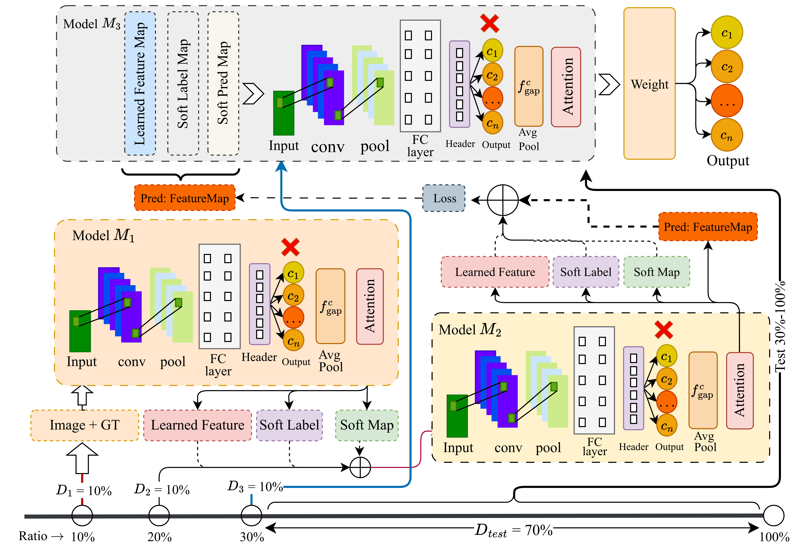

# WeCKD: Weakly-supervised Chained Distillation Network for Efficient Multimodal Medical Imaging

## Overview
This repository contains the official implementation of our proposed model **WeCKD**.

Our approach redefines knowledge transfer through a structured, progressive distillation chain (M1 → M2 → M3). Each model in the chain is trained on only a fraction of the dataset (10% per stage) and refines the knowledge passed forward from its predecessor.


<p align="center">
  <!-- Replace with your architecture image link -->
  
</p>

---

## Highlights:

> **Chain-based Sequential KD:** Introduces a progressive KD where knowledge is transferred through multiple intermediate models. Each stage refines the representations and reduces knowledge degradation without requiring a single/massive pre-trained teacher.

> **Attention-based Feature Refinement:** Incorporates a spatial attention mechanism within the distillation process to ensure models dynamically focus on the most discriminative and clinically relevant regions learned by their predecessors.

> **Dynamic Temperature Annealing:** Utilizes a temperature-scaled distillation strategy that dynamically adjusts probability distributions over epochs.

> **Automated Hyperparameter Tuning:** Employs Bayesian optimization (Optuna) to automatically and efficiently tune critical distillation hyperparameters (learning rate, distillation weight, temperature scaling factor) without manual intervention.

> **Data-Efficient Weak Supervision:** Shows that effective learning and SOTA generalization can be achieved using only 30% of the total labeled data (10% per stage in the chain) across diverse medical imaging modalities.

---

## Directories

```text
├── /data/*
├── /distillation/*
├── /models/*
├── /optimization/*
├── /preprocessing/*
├── /temperature_scheduling/*
├── /utils/*
└── figs/
*.py
*.ipynb
*.env
*.ipynb_checkpoints
*.hdf5
```
Detailed usage instructions will be updated soon.

## Citation

The manuscript is currently under review. The preprint can be cited with the following:

```bibtex
@article{rahman2025weckd,
  title={WeCKD: Weakly-supervised Chained Distillation Network for Efficient Multimodal Medical Imaging},
  author={Rahman, Md. Abdur and Raiaan, Mohaimenul Azam Khan and Azam, Sami and Karim, Asif and Beissbarth, Jemima and Leach, Amanda},
  journal={arXiv preprint arXiv:2510.14668},
  year={2025}
}
```